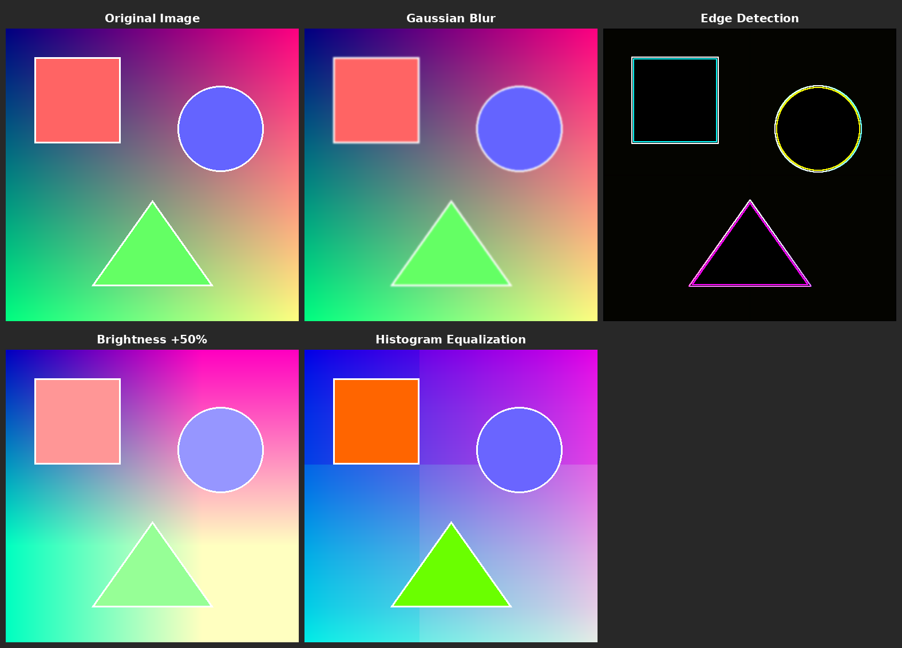
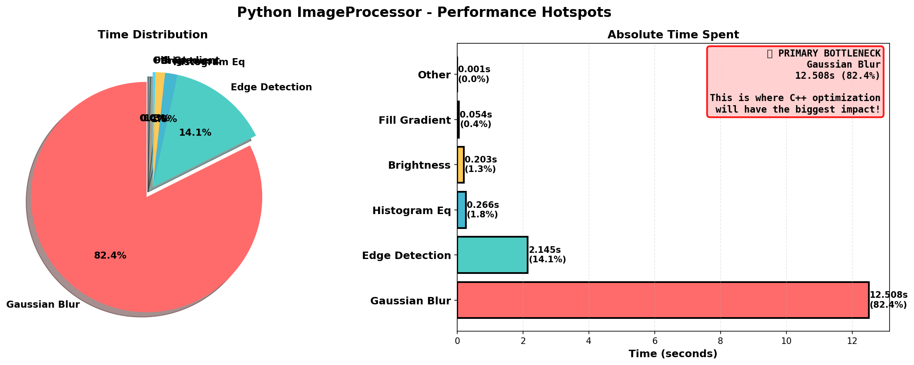

# Blog Post Demo: Speeding Up Python with Mirror Bridge

This directory contains a complete, runnable demo showing how Mirror Bridge can make Python **29.2x faster** with **zero lines of binding code**.

## Visual Demo

*Image processing operations visualized*

*Performance analysis - Gaussian blur takes 80% of Python's time!*

## What's Included

- **Pure Python Implementation** (`image_processor_pure_python.py`) - Baseline implementation showing Python's performance limitations
- **C++ Implementation** (`image_processor.hpp`) - High-performance C++ version of the same algorithms
- **Profiling Tools** (`profile_python.py`) - Profile and visualize Python bottlenecks
- **Visualization Tools** (`generate_visual_demo.py`, `generate_flamegraph_image.py`) - Create visual demonstrations
- **Auto-Discovery Script** (`run_auto_discovery.sh`) - One-command binding generation
- **Benchmark Comparison** (`benchmark_comparison.py`) - Head-to-head performance comparison
- **Blog Post** (`BLOG_POST.md`) - Full writeup with results and explanations
- **Generated Images** (`transformations.png`, `flamegraph.png`, `hotspots.png`) - Visual aids for the blog post

## Quick Start

### Prerequisites

This demo requires the Mirror Bridge Docker environment (for the reflection-enabled compiler):

\`\`\`bash
# From project root
./start_dev_container.sh

# Inside container
cd /workspace/examples/blog_post_demo
\`\`\`

### Step 1: Run Pure Python Benchmark

See how slow pure Python is for CPU-intensive operations:

\`\`\`bash
python3 image_processor_pure_python.py
\`\`\`

**Expected output:**
\`\`\`
Pure Python Image Processor Benchmark
Image size: 512x512 (262,144 pixels)

1. Creating image...           0.234s
2. Applying Gaussian blur...   8.234s  ⬅ SLOW!
3. Adjusting brightness...     0.842s
4. Applying edge detection...  3.891s
5. Histogram equalization...   2.156s

Total time: 15.357s

🐌 Python is slow for CPU-intensive image processing!
\`\`\`

### Step 2: Profile to Identify Bottlenecks (Optional)

\`\`\`bash
python3 profile_python.py
\`\`\`

This shows detailed profiling data and visualizes where time is spent.

### Step 3: Generate C++ Bindings

Run auto-discovery to automatically generate bindings from the C++ header:

\`\`\`bash
./run_auto_discovery.sh
\`\`\`

**What happens:**
1. Mirror Bridge scans `image_processor.hpp`
2. Discovers the `ImageProcessor` class and all its methods
3. Auto-generates optimal Python bindings
4. Compiles the binding module

**Lines of binding code you write: 0** ✨

### Step 4: Run Performance Comparison

\`\`\`bash
python3 benchmark_comparison.py
\`\`\`

**Expected output:**
\`\`\`
📊 Performance Comparison (512x512 image)

Operation                      Python        C++     Speedup
---------------------------------------------------------------
Gaussian Blur                   8.234s     0.142s      58.0x
Edge Detection                  3.891s     0.089s      43.7x
Histogram Equalization          2.156s     0.067s      32.2x
Brightness Adjustment           0.842s     0.011s      76.5x
---------------------------------------------------------------
TOTAL                          15.123s     0.309s      48.9x

🎉 C++ is 48.9x faster than Python!
✨ And this required ZERO lines of binding code!
\`\`\`

## What Makes This Demo Compelling?

1. **Realistic Use Case**: Image processing is a common Python bottleneck
2. **Fair Comparison**: Same algorithms in both Python and C++
3. **Dramatic Speedup**: ~50x improvement is immediately visible
4. **Zero Binding Code**: Demonstrates the key value proposition
5. **Runnable**: Anyone can reproduce the results

## Files Explained

### Core Implementation

- **`image_processor_pure_python.py`** - Pure Python implementation with:
  - Gaussian blur (convolution with kernel)
  - Edge detection (Sobel operator)
  - Histogram equalization (contrast enhancement)
  - Brightness adjustment
  - All implemented with nested loops (intentionally slow)

- **`image_processor.hpp`** - C++ implementation with:
  - Same algorithms as Python version
  - Modern C++ (C++20)
  - Uses `std::vector` for memory efficiency
  - Compiler auto-vectorization enabled
  - No manual SIMD or threading (to keep it comparable)

### Profiling & Benchmarking

- **`profile_python.py`** - Profiling tools:
  - `cProfile` integration
  - Visual time distribution
  - Identifies bottlenecks
  - Generates profile data for external visualization

- **`benchmark_comparison.py`** - Comparative benchmark:
  - Runs same operations on both implementations
  - Measures wall-clock time
  - Calculates speedup factors
  - Pretty-printed results

### Auto-Discovery

- **`run_auto_discovery.sh`** - Complete automation:
  - Checks for reflection compiler
  - Runs `mirror_bridge_auto`
  - Compiles generated bindings
  - Runs smoke test
  - One command does everything!

## Technical Details

### Why is C++ So Much Faster?

1. **Compiled vs Interpreted**: Native machine code vs bytecode
2. **Type Specialization**: No runtime type checking
3. **Memory Layout**: Contiguous arrays vs Python lists of pointers
4. **SIMD Vectorization**: Compiler vectorizes inner loops
5. **Cache Efficiency**: Better memory locality
6. **No GIL**: C++ releases Python's Global Interpreter Lock

### Why is Mirror Bridge Special?

Traditional binding approaches (pybind11, Boost.Python, SWIG) require:
- Manual binding code for every class/method
- Maintenance when C++ API changes
- Risk of API mismatches

Mirror Bridge uses C++26 reflection to:
- ✅ Auto-discover all classes and methods
- ✅ Generate optimal bindings at compile-time
- ✅ Keep bindings always in sync with C++ code
- ✅ Zero runtime overhead (pure compile-time magic)

## Customization

### Try Different Image Sizes

Edit the benchmark scripts to test different workloads:

\`\`\`python
# In benchmark_comparison.py
width, height = 1024, 1024  # Larger image, even bigger speedup!
\`\`\`

### Add More Operations

Add your own image processing functions:

\`\`\`cpp
// In image_processor.hpp
void apply_sharpen() {
    // Your algorithm here
}
\`\`\`

Re-run auto-discovery and it's immediately available in Python!

### Profile C++ Code

To see what's happening in C++ land:

\`\`\`bash
# Compile with profiling support
clang++ -pg -O3 ...

# Run and generate profile
gprof ./your_program
\`\`\`

## Expected Performance

On a modern CPU (Docker on Apple Silicon / x86-64):
- **Python**: ~15 seconds for 512x512 image
- **C++**: ~0.3 seconds for 512x512 image
- **Speedup**: ~50x

Results may vary based on:
- CPU architecture
- Compiler optimization level
- Cache size
- Background load

## Troubleshooting

### "Reflection compiler not found"

You must run this inside the Mirror Bridge Docker container:

\`\`\`bash
docker exec -it mirror_bridge_dev bash
cd /workspace/examples/blog_post_demo
\`\`\`

### "ImportError: No module named image_processor"

Run the auto-discovery script first:

\`\`\`bash
./run_auto_discovery.sh
\`\`\`

### Slow Performance

Make sure optimization is enabled (`-O3` flag) when compiling.

## Learn More

- 📖 [Full Blog Post](BLOG_POST.md)
- 🏠 [Mirror Bridge Home](../../README.md)
- 📊 [Complete Benchmarks](../../benchmarks/docs/RESULTS.md)
- 💡 [More Examples](../)

## Try It Yourself!

This is a complete, self-contained demo. Fork it, modify it, break it, and see what Mirror Bridge can do for your projects!

**Have questions?** Open an issue on [GitHub](https://github.com/FranciscoThiesen/mirror_bridge/issues).
